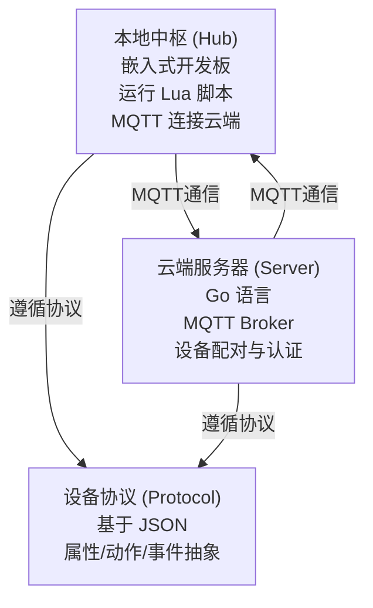

# 智家 (ZhiJia) - 一个本地优先、可编程的开源智能家居核心

[GitHub](https://github.com/pxwg/Smart-Home)

## 这是什么？

“智家”是一个开源的智能家居项目。市面上大多数智能家居产品都过度依赖云端服务器，不仅有隐私风险，断网就瘫痪。

这个项目的核心思路很简单：**把控制权还给用户**。

我们想做一个真正运行在你家里的智能中枢。自动化逻辑在本地处理，云端只扮演一个“信使”的角色，帮你从外部安全地访问家里的设备。最重要的是，它足够开放，你可以用脚本自己定义想要的自动化场景，而不是被厂商预设的几个简单规则框住。

## 核心原则

1.  **隐私优先**: 运算和自动化主要在本地的“智家中枢”上跑，云端服务器只负责转发指令，不储存和分析你的个人习惯。
2.  **开放协议**: 我们用标准、简单的协议 (MQTT, JSON)，方便你自己 DIY 硬件或者接入其他生态的东西。不搞私有协议。
3.  **拥抱社区**: 除了对于自身简单协议的支持，我们也将主动支持 Home Assistant 等主流开源智能家居平台，方便用户将“智家”集成到已有的智能家居系统中。
4.  **用脚本实现真自动化**: 不止是简单的低代码可视化平台，实现有限的自动化功能。项目内嵌了 Lua 引擎，你可以写代码来控制设备，实现任何你想要的复杂逻辑，比如“检查过去 10 分钟的湿度变化率，再决定是否开除湿机半小时”。甚至可以使用 github 作为“插件管理器”，安装别人写好的脚本。

## 系统设计

整个系统包含三个部分：

1.  **本地中枢 (Hub)**
    * 运行在一个嵌入式开发板上，是你家的智能大脑。
    * 负责连接和控制家里的各种小工具。
    * 运行 Lua 脚本，处理所有自动化。
    * 通过 MQTT 连接云端，接收远程指令。

2.  **云端服务器 (Server)**
    * 用 Go 语言编写，部署在你自己的服务器上。
    * 作为一个轻量级的 MQTT Broker，安全地转发你手机和家中中枢之间的消息。
    * 处理设备配对和认证。

3.  **设备协议 (Protocol)**
    * 一套基于 JSON 的简单规范。
    * 任何设备都可以被抽象为有“属性 (Properties)”、“动作 (Actions)”和“事件 (Events)”，方便上层用统一的方式调用。

## 开发计划 (Roadmap)

项目会一步一步来，先实现核心功能。

* **v0.1: 跑通基本通信**
    * [ ] 云端 MQTT 服务器能跑起来。
    * [ ] 开发板能连上 Wi-Fi，作为 MQTT 客户端连上服务器。
    * [ ] 能从电脑上发个 MQTT 消息，让开发板上的 LED 灯亮起来。

* **v0.2: 集成 Lua 脚本引擎**
    * [ ] 把 Lua 虚拟机移植到开发板固件里。
    * [ ] 提供最基本的 Lua API，比如 `device.call_action()`。
    * [ ] 实现中枢能接收指令，然后调用本地的 Lua 脚本来控制 LED。

* **v0.3: 实现远程控制 (MVP，Minimum Viable Product)**
    * [ ] 写一个简单的网页或 App，用来登录和发指令。
    * [ ] 搞定设备和用户账号的安全绑定流程。
    * [ ] 设备状态（比如传感器数据）能上报到云端并显示出来。

* **v0.5: 真正的自动化**
    * [ ] 丰富 Lua API，加入定时器 (`timer.run_after`) 和事件监听，完善嵌入式 Lua 库。
    * [ ] 实现当某个设备上报事件时，能自动触发对应的脚本。
    * [ ] 做一个能上传和管理自动化脚本的界面。

* **v1.0: 接入第一个外部设备**
    * [ ] 确定 v1.0 的设备模型标准。
    * [ ] 尝试写一个适配器，接入一个现成的设备（比如用蓝牙读取小米的温湿度传感器）。
    * [ ] 写好文档，让其他人也能参与进来，为“智家”添加更多设备支持。
    * [ ] 支持 Home Assistant 的集成。

## 竞品对比

为了明确“智家”项目的定位，我们将其与两个成熟的开源平台 Home Assistant 和 openHAB 进行了对比。

### 核心理念：

- Home Assistant: 优先考虑用户体验和易用性，拥有最庞大的设备集成生态和活跃的社区，适合从初学者到高级用户的广泛人群。   

- openHAB: 采用企业级的 Java 和 OSGi 架构，强调模块化、稳定性和高度可定制性，学习曲线较陡，更受技术专家青睐。   

- 智家 (ZhiJia): 定位为为开发者打造的高性能核心。我们选择 Go + C/C++ + Lua 的技术栈，旨在提供一个更轻量、资源占用更低、部署更简单的平台，尤其适合追求极致性能和复杂自动化逻辑的开发者。

### 生态系统策略：

- Home Assistant 拥有数千个官方集成，这是一个巨大的优势。   

- “智家”在初期不会追求原生集成的数量。我们的策略是拥抱互操作性，通过提供一流的 MQTT 支持，无缝接入 Zigbee2MQTT 等现有生态系统，从而用最小的成本快速支持大量设备。

### 自动化实现：

- Home Assistant 提供了从图形化界面、蓝图（模板）到专业脚本（如 Node-RED）的多层次自动化方案，满足不同用户的需求。   

- openHAB 提供规则 DSL、Blockly（可视化编程）和 JSR223 脚本（如 Python/JS）等多种强大的编程范式。   

- “智家”初期将专注于 Lua 脚本引擎，赋予用户最大的灵活性，用代码实现任何复杂的、有状态的自动化逻辑，而不是被简单的“触发 - 条件 - 动作”模型所限制。

总而言之，“智家”并非要取代现有平台，而是在一个成熟的市场中，为那些看重架构简洁性、高性能和编程自由度的技术型用户，提供一个更纯粹、更现代的选择。

## 技术栈

* **云端后端**: Go
* **中枢固件**: C/C++
* **脚本引擎**: Lua
* **通信协议**: MQTT, HTTPS
* **数据格式**: JSON

欢迎各种建议和贡献！
